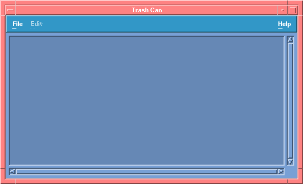

# Referência das barras do Trash Can SR10.4

Captura do Trash Can nativo na VM Domain/OS SR10.4 com HP VUE 2.01, em 2026-10-10.
As imagens são recortes em pixels nativos, sem interpolação. A captura completa
e os recibos de controle da sessão ficam nos registros privados de validação.

O [arquivo de métricas](TRASH-CAN-METRICAS.json) registra a identidade da captura,
as regiões medidas e os hashes dos recortes. O estado normal mostra a geometria
e a iluminação. Como a lixeira está vazia, ele não demonstra rolagem do conteúdo
ou os estados pressionado e desabilitado.

O ensaio posterior da seta inferior está em
[SETA-INFERIOR-ESTADOS.json](SETA-INFERIOR-ESTADOS.json): manter pressionado
inverte 53 pixels de luz/sombra; soltar restaura o triângulo. Os nove pixels
brancos de cursor fora da silhueta foram preservados como contexto, sem
alterar a referência para fabricar uma comparação integral perfeita.

Comparar separadamente o triângulo, o botão, o trilho, o thumb, a moldura do
conteúdo e o canto entre as barras. A [fila de revisão](../../DOMAINOS-FILA-REVISAO-VISUAL.md)
registra as etapas por família e seus resultados.
